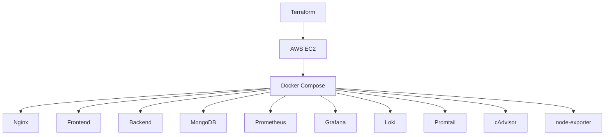

# ProShop MERN Capstone Deployment

Source code reference: [bannguyenhuce/proshop_mern](https://github.com/bannguyenhuce/proshop_mern)

Tài liệu này mô tả cách triển khai ProShop MERN theo hướng gần production:

- `terraform/` tạo hạ tầng AWS.
- `proshop_mern/` chứa source code ứng dụng gốc.
- `app-stack/` chỉ chứa lớp deploy cho app.
- `monitoring-stack/` chứa monitoring và logging.

## Mục tiêu

- Tự động tạo EC2 bằng Terraform.
- Chạy app thật từ source repo gốc.
- Dùng Nginx làm reverse proxy.
- Quan sát hệ thống bằng Prometheus, Grafana, Loki, Promtail, cAdvisor, node-exporter.

## Kiến trúc tổng thể



## Cấu trúc thư mục

```text
project/
├── proshop_mern/
│   ├── backend/
│   ├── frontend/
│   └── uploads/
├── terraform/
├── app-stack/
│   ├── docker-compose.yml
│   └── nginx/
└── monitoring-stack/
    ├── docker-compose.yml
    ├── prometheus/
    ├── loki/
    └── promtail/
```

## App stack

`app-stack/docker-compose.yml` chỉ giữ các phần triển khai:

- `nginx`
- `frontend` pull từ `ghcr.io/ldthanh259/proshop_mern-frontend:latest`
- `backend` pull từ `ghcr.io/ldthanh259/proshop_mern-backend:latest`
- `mongodb`

### Luồng build image

- Source code nằm trong `proshop_mern/`
- GitHub Actions build image từ source đó
- Image được đẩy lên GitHub Container Registry
- EC2 chỉ cần `docker compose up -d` để pull và chạy

### Frontend runtime modes

- `serve` là mode mặc định, gọn và dễ dùng cho static React build.
- `node` là mode thay thế khi bạn muốn một runtime Node tự phục vụ file tĩnh.
- Local mode:
  - `app-stack/docker-compose.local.yml` dùng `serve`
  - `app-stack/docker-compose.local.node.yml` ghép cùng file local cơ sở để dùng `node`
- GHCR mode:
  - `app-stack/docker-compose.yml` dùng `serve`
  - `app-stack/docker-compose.node.yml` ghép cùng file GHCR cơ sở để dùng `node`

## Monitoring stack

`monitoring-stack/` gồm:

- Prometheus
- Grafana
- Loki
- Promtail
- node-exporter
- cAdvisor

## Terraform

Terraform tạo:

- Security Group
- EC2 instance
- public IP output

### Chạy Terraform

```bash
cd terraform
terraform init
terraform apply
```

## Chạy app

```bash
cd app-stack
docker compose up -d --build
```

## Chạy monitoring

```bash
cd monitoring-stack
docker compose up -d
```

## Kiểm tra

- App: `http://SERVER_IP`
- Grafana: `http://SERVER_IP:3000`
- Prometheus: `http://SERVER_IP:9090`

## Datasource Grafana

- Prometheus: `http://prometheus:9090`
- Loki: `http://loki:3100`

## Checklist

### Trước khi deploy

- [ ] Điền `admin_ip_cidr` đúng IP của bạn.
- [ ] Điền `ami_id` đúng theo region.
- [ ] Điền `key_name` đúng tên key pair.
- [ ] Tạo Docker network `observability`.

### Sau khi deploy

- [ ] `docker ps` hiển thị đủ container.
- [ ] App mở được qua Nginx.
- [ ] Grafana truy cập được.
- [ ] Prometheus scrape được `node-exporter` và `cadvisor`.
- [ ] Loki nhận log từ Promtail.

## Ghi chú

Các file placeholder trong `app-stack/` đã được loại bỏ để tránh trùng lặp với source thật trong `proshop_mern/`.

Xem hướng dẫn thực hành chi tiết tại [`HUONG_DAN_THUC_HANH.md`](F:\Cloud Computing\Capstone Project\HUONG_DAN_THUC_HANH.md).
